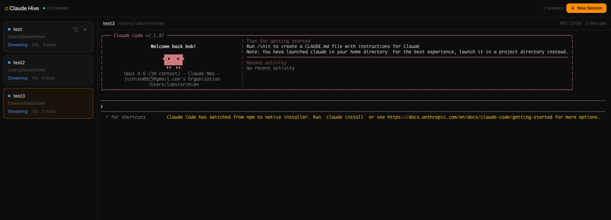
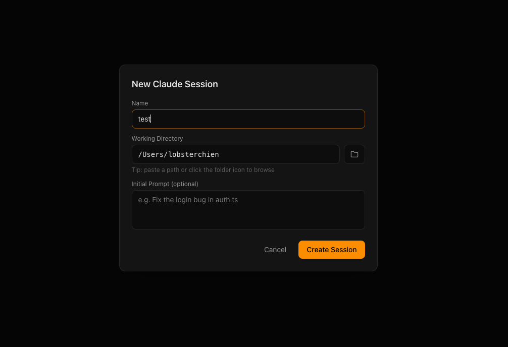

# Claude Hive

<p align="center">
  
</p>

Open-source multi-session Claude Code monitor & manager. Spawn, watch, and control multiple Claude Code instances from a single web dashboard.


## Screenshots

<p align="center">
  
</p>

<p align="center">
  
</p>

## Why

If you run multiple Claude Code sessions across different projects, switching between terminal tabs is painful. Claude Hive gives you one screen to see all sessions, their status, and full terminal output — with the ability to interact, kill, or restart any session.

## Features

- **Live terminal rendering** — Full xterm.js terminals in the browser with colors, formatting, and scrollback
- **Session management** — Spawn new Claude Code instances, kill, restart from the dashboard
- **Status detection** — Automatic detection of idle, streaming, tool use, and waiting-for-approval states
- **Input forwarding** — Type directly into any session from the browser
- **Session naming & color tags** — Rename sessions and assign color labels for quick identification
- **Multiple layouts** — Single, tabs, grid (2×2), horizontal split, and vertical split views
- **Session groups** — Organize sessions into named groups
- **Metrics tracking** — Session duration, tool call count, token estimates, cost estimates
- **Log export** — Export session logs as plain text, JSON, or raw ANSI
- **Dark/light theme** — Toggle between dark and light mode
- **SSH support** — Connect to remote machines and run Claude Code over SSH
- **Reconnect support** — New browser tabs receive buffered terminal history
- **Directory browser** — Browse directories from the new-session dialog with `~` expansion
- **macOS app** — Bundled `.app` wrapper for one-click launch from Finder
- **One-click launch** — Double-click `Claude Hive.command` or run `./launch.sh`

## Architecture

```
claude-hive/
├── apps/web/              # Next.js dashboard (port 3000)
│   ├── app/               # App Router pages
│   ├── components/        # Terminal panel, session cards, dialogs
│   └── lib/               # WebSocket hook (useHive), theme context
├── packages/server/       # Hive server (port 9900)
│   └── src/
│       ├── index.ts       # WebSocket server
│       └── session-manager.ts  # PTY lifecycle manager
├── packages/shared/       # Shared types, protocol & constants
├── launch.sh              # CLI launcher
├── Claude Hive.command    # Double-click launcher (macOS)
├── Claude Hive.app/       # macOS app bundle
├── turbo.json             # Turborepo config
└── pnpm-workspace.yaml    # Monorepo workspace
```

**How it works:**

1. The **hive server** spawns Claude Code processes in pseudo-terminals (via `node-pty`)
2. Terminal I/O is streamed over **WebSocket** to connected browser clients
3. The **web dashboard** renders each session in an xterm.js terminal with full ANSI support
4. User input in the browser is forwarded back through the WebSocket to the PTY

## Prerequisites

- **Node.js** >= 20
- **pnpm** (`npm install -g pnpm`)
- **Claude Code** CLI installed and authenticated (`npm install -g @anthropic-ai/claude-code`)

## Quick Start

```bash
# Clone the repo
git clone https://github.com/jtchien0925/claude-hive.git
cd claude-hive

# Install dependencies
pnpm install

# Launch (starts both server and web dashboard, opens browser)
./launch.sh
```

Or double-click `Claude Hive.command` in Finder. On macOS, you can also use the bundled `Claude Hive.app`.

## User Guide

### Starting Claude Hive

**Option 1: macOS App** — Double-click `Claude Hive.app`. It starts the server and web dashboard, then opens your browser.

**Option 2: Double-click** — Open the project folder in Finder and double-click `Claude Hive.command`. A terminal window opens, dependencies install (first time only), and the dashboard opens in your browser.

**Option 3: Terminal** — Run `./launch.sh` from the project root. Same result.

**Option 4: Dev mode** — Run `pnpm dev` to start both the server and web app via Turborepo with hot reload.

The dashboard is at **http://localhost:3000**. The hive server runs on **ws://localhost:9900**.

### Creating a Session

1. Click the **"New Session"** button (top right)
2. Fill in the form:
   - **Name** — A label for this session (e.g., "Auth bugfix", "API refactor")
   - **Working Directory** — The project path. Use `~` for home directory (e.g., `~/projects/my-app`). Use the built-in directory browser to navigate.
   - **Initial Prompt** (optional) — A prompt to send to Claude immediately (e.g., "Fix the login bug in auth.ts")
   - **Color** (optional) — Assign a color tag for quick identification
   - **SSH** (optional) — Connect to a remote machine by specifying host, user, port, identity file, and remote working directory
3. Click **"Create Session"**

A new Claude Code process starts in the specified directory. The terminal appears in the main panel.

### Interacting with Sessions

- **Click a session** in the sidebar to view its terminal
- **Type in the terminal** — Your keystrokes are forwarded to the Claude Code process
- **Scroll** — Mouse wheel or trackpad to scroll through history
- **Right-click a session** to rename, change color, or export logs

### Layouts

Use the layout switcher in the toolbar to change how terminals are displayed:

| Layout | Description |
|--------|-------------|
| Single | One terminal at a time |
| Tabs | Tab bar at top, one terminal below |
| Grid | Up to 4 terminals in a 2×2 grid |
| Split-H | Two terminals side by side |
| Split-V | Two terminals stacked vertically |

### Session Groups

Organize sessions into named groups via the groups sidebar. Create a group, then drag or assign sessions to it for better organization across large workloads.

### Session Status Indicators

Each session card shows a colored dot indicating its current state:

| Dot | Status | Meaning |
|-----|--------|---------|
| Gray | Idle | Waiting for input |
| Blue (pulsing) | Streaming | Claude is generating a response |
| Purple (pulsing) | Tool Use | Claude is executing a tool (file read, edit, bash) |
| Amber (pulsing) | Waiting | Claude needs approval for an action |
| Red | Error | Something went wrong |
| Dark gray | Stopped | Process has exited |

### Session Controls

Hover over a session card in the sidebar to reveal action buttons:

- **Restart** (circular arrow) — Kills the session and starts a new one in the same directory
- **Kill** (X) — Terminates the Claude Code process

### Sidebar Metrics

Each session card shows:
- **Status label** — Current state in text
- **Duration** — How long the session has been running
- **Tool calls** — Number of tool invocations detected
- **Tokens** — Estimated token usage
- **Cost** — Estimated API cost

### Exporting Logs

Export any session's terminal output via the session context menu:
- **Text** — Clean text with ANSI codes stripped
- **JSON** — Structured data with session metadata
- **ANSI** — Raw terminal output with full formatting

### Multiple Browser Tabs

You can open the dashboard in multiple browser tabs. All tabs stay in sync — they share the same WebSocket connection to the hive server. New tabs automatically receive the buffered terminal history.

### Keyboard Shortcuts

All standard terminal shortcuts work since input is forwarded directly to the PTY:
- `Ctrl+C` — Interrupt the current operation
- `Ctrl+D` — Send EOF
- `Ctrl+L` — Clear terminal
- Arrow keys, Tab completion — All work as expected

## Configuration

| Environment Variable | Default | Description |
|---------------------|---------|-------------|
| `HIVE_PORT` | `9900` | WebSocket server port |

## Development

```bash
# Start in dev mode (hot reload for both server and web)
pnpm dev

# Build everything
pnpm build

# Run only the server
cd packages/server && pnpm dev

# Run only the web dashboard
cd apps/web && pnpm dev
```

## Roadmap

- [x] Session naming and color tags
- [x] Token usage and cost estimation
- [x] SSH support for remote machines
- [x] Session groups and layouts (grid, tabs, split)
- [x] Export session logs
- [x] Dark/light theme toggle
- [ ] Persistent sessions across server restarts
- [ ] Session templates / presets (save frequently used configs)
- [ ] Broadcast input to multiple sessions simultaneously
- [ ] Search / filter across session output
- [ ] Notifications (desktop alerts when a session needs approval)
- [ ] Authentication for multi-user access
- [ ] Electron or Tauri desktop app
- [ ] Plugin system for custom status detectors
- [ ] Session history and replay

## Contributing

Contributions are welcome! Please open an issue or submit a pull request.

```bash
# Fork and clone
git clone https://github.com/jtchien0925/claude-hive.git

# Install and start dev mode
pnpm install
pnpm dev
```

## Author

Created by **JT Chien**, founder of **JT Chien Studio** — an AI systems implementation consultancy based in Atlanta, working globally. JT is Managing Director at String Capital, Board Member at GeoSynergy Group, and Visiting Professor in Computer Science at Emory University.

## License

MIT
